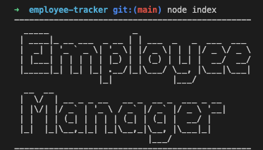

# Employee Database
  
  ## Description
  This MySQL database application allows you to view, add, update, and delete departments, roles, and employees. 

  
  ## Table of Contents
  * [Installation](#installation)
  * [Usage](#usage)
  * [License](#license)
  * [Contributing](#contributing)
  * [Tests](#tests)
  * [GitHub](#github)

  ## Installation
  This application requires the npm packages figlet, mysql2, console.table, and inquirer. Use `npm install figlet mysql2 console.table inquirer`

  ## Usage
  This app is for demonstration purposes only. View the screencastify link to see installation and demonstration.
 
  [Screencastify Link](https://watch.screencastify.com/v/vaRBZiOyDb41mSxNjnPZ) 

  

  ## License
    
  This project uses  the [MIT](https://opensource.org/licenses/MIT) license.

  ## Contributing
  This project follows the Contributor Covenant.  
  

  ## Questions
  Reach out via email or GitHub.  
  cassie.s.simpson@gmail.com  
  [https://github.com/cassie-s](https://github.com/https://github.com/cassie-s/)
